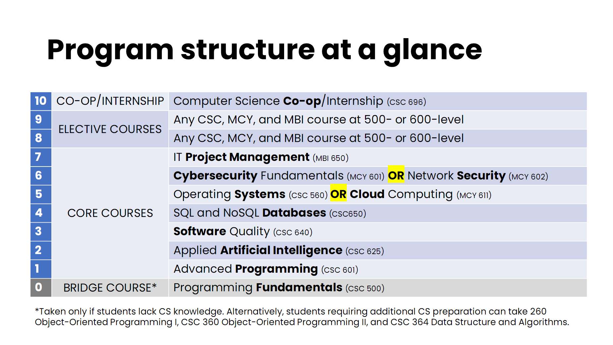

# NKU's Master's Program in Computer Science repository

Welcome to the repository of NKU's Master's Program in Computer Science (MSCS).
This repository is designed to help students learn more about the program and succeed. If you have any questions, please contact the program director.

# Structure of the program

# Curriculum planner
To make it easier to plan your curriculum, please use the planner at https://nku-sca-mscs.github.io/main/planner/

# Program Director
For any questions, please contact Dr. Nicholas Caporusso (caporusson1@nku.edu)

## Resources
- **Program description**: visit the [MSCS program description page](./MSCS-program-description.md).
- **Course catalog**: [https://www.nku.edu/admissions/graduate/current-students/Catalog.html](https://www.nku.edu/registrar/catalog/index.html)
- **Frequently Asked Questions**: visit the [FAQ page](./FAQ.md)
